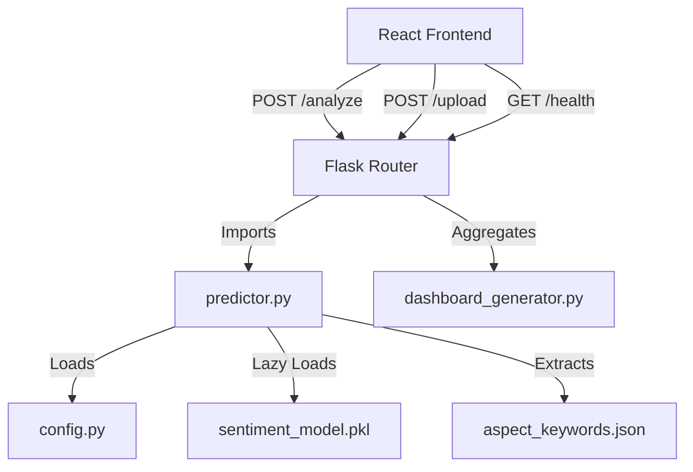

# SentimentScope Master Guide

* **Document Name**: SentimentScope Master Guide
* **Version**: 1.6.0
* **Project Status**: Phase 7 Complete (Production Pipeline & Deployment Ready)
* **Last Updated**: 2026-08-07
* **Maintained By**: Ashish Bavaliya
* **Purpose**: Authoritative engineering handbook and single source of truth for the SentimentScope project.

---

## Document Version History

| Version | Date | Description | Author |
| :--- | :--- | :--- | :--- |
| **1.0** | 2026-07-27 | Initial handbook created after Architecture Freeze and Infrastructure Phase 1 | Ashish Bavaliya |
| **1.1** | 2026-07-28 | Implementation Phase 2 (Advanced Text Preprocessing) completed | Ashish Bavaliya |
| **1.2** | 2026-07-28 | Implementation Phase 3 (Feature Engineering & Chi-Square) completed | Ashish Bavaliya |
| **1.3** | 2026-07-28 | Implementation Phase 4 (Model Training, CV & Benchmarking) completed | Ashish Bavaliya |
| **1.3.1** | 2026-07-28 | Implementation Phase 4.5 (Benchmark Refinement & Visualizations) completed | Ashish Bavaliya |
| **1.4** | 2026-07-28 | Implementation Phase 5 (Hyperparameter Optimization Sweeps) completed | Ashish Bavaliya |
| **1.5** | 2026-08-06 | Implementation Phase 6 (Scientific Validation & Selection) completed | Ashish Bavaliya |
| **1.5.1** | 2026-08-06 | Implementation Phase 6.5 (Pre-Deployment Verification Audit) completed | Ashish Bavaliya |
| **1.5.2** | 2026-08-06 | Implementation Phase 6.5 (Corrective Pass & Synchronization) completed | Ashish Bavaliya |
| **1.5.3** | 2026-08-06 | Implementation Phase 6.75 (Research Freeze & Verification) completed | Ashish Bavaliya |
| **1.5.4** | 2026-08-06 | Documentation patch (EXP-03 / EXP-04 synced to completed status) | Ashish Bavaliya |
| **1.6.0** | 2026-08-07 | Phase 7 Completed: Production pipeline integration, health checks, batch prediction, and benchmarks. | Ashish Bavaliya |

---

## Table of Contents
1. [Project Overview](#1-project-overview)
2. [Developer Profile](#2-developer-profile)
3. [Repository Overview](#3-repository-overview)
4. [Current Architecture](#4-current-architecture)
5. [Research Overview](#5-research-overview)
6. [Finalized Research Methodology](#6-finalized-research-methodology)
7. [Implementation Workflow](#7-implementation-workflow)
8. [Implementation Phases](#8-implementation-phases)
9. [Experimentation Roadmap](#9-experimentation-roadmap)
10. [Research Paper Roadmap](#10-research-paper-roadmap)
11. [Coding Standards](#11-coding-standards)
12. [Antigravity Prompt Guidelines](#12-antigravity-prompt-guidelines)
13. [Implementation Tracker Standard](#13-implementation-tracker-standard)
14. [Project Rules](#14-project-rules)
15. [Current Progress Dashboard](#15-current-progress-dashboard)
16. [Future Roadmap](#16-future-roadmap)
17. [Conversation Continuation Guide](#17-conversation-continuation-guide)
18. [Appendices](#18-appendices)

---

## 1. Project Overview

### Project Title
**SentimentScope: AI-Powered Product Review Sentiment Analysis and Business Intelligence Platform**

### Purpose
SentimentScope is designed to bridge the gap between simple text classification and actionable Business Intelligence (BI). It ingests raw e-commerce reviews, processes them using a standardized machine learning pipeline, and extracts operational insights (aspect highlights, product complaints, category trends) to compute a multi-dimensional **Product Health Score** and generate optimization recommendations for businesses.

### Problem Statement
Modern businesses struggle to process large volumes of text reviews. Simple average ratings (1-5 stars) fail to explain *why* users are dissatisfied, and generic sentiment classifiers do not correlate text results with operational topics like battery performance, pricing issues, or delivery delays. SentimentScope addresses this by providing a unified classification and aspect-mining framework.

```
[Raw E-Commerce Reviews]
           ↓
[Preprocessing & Feature Selection]
           ↓
[Classifier (SVM/Logistic Regression)] → [Sentiment Class]
           ↓
[Rule-Based Aspect Extraction]        → [Operational Complaint / Highlight]
           ↓
[Business Intelligence Aggregator]    → [Product Health Score / Recommendations]
```

### Objectives
1. Build a robust, leakage-free text classification pipeline.
2. Develop a rule-based aspect mining engine mapping classifications to operational categories (Delivery, Quality, Features, Pricing).
3. Compute a mathematically justified **Product Health Score** to assess product quality over time.
4. Construct an interactive React/Flask dashboard to present batch metrics.

### Expected Users
* **Product Managers**: To evaluate feature requests and locate defects.
* **Operations Managers**: To track delivery delays and shipping issues.
* **Academic Reviewers**: To assess traditional ML optimization pipelines.

### Non-Goals
* Deep Learning, Transformer models (BERT, RoBERTa), and LLMs are excluded from the current scope.
* Database persistence (PostgreSQL/SQLAlchemy) is postponed; the dashboard reads in-memory from CSV snapshots.

---

## 2. Developer Profile

* **Developer Name**: Ashish Bavaliya
* **GitHub Username**: `Ashish-303`
* **GitHub Email**: `ashishbavaliya535@gmail.com`
* **Degree**: B.Tech in Computer Science and Engineering (AI & ML Specialization)
* **University**: P P Savani University
* **Project Type**: Solo B.Tech Final Year Research Project
* **Graduation Timeline**: May 2027
* **Research Goal**: Publish a peer-reviewed paper in an IEEE/Springer Scopus-indexed conference or journal by showcasing a scientifically rigorous evaluation of classical ML text classifiers.

---

## 3. Repository Overview

The repository structure isolates application services, configurations, test suites, and ML pipelines:

```
SentimentScope/
├── backend/
│   ├── app.py                      # Application Entry Point
│   ├── config.py                   # Centralized Configuration Manager
│   ├── configs/
│   │   └── aspect_keywords.json    # Dynamic aspect extraction rules
│   ├── routes/                     # Flask API Blueprints
│   ├── ml/
│   │   ├── data/                   # Raw & balanced CSV datasets
│   │   ├── models/                 # Serialized model pickles
│   │   ├── notebooks/              # Exploratory notebooks (01 to 11)
│   │   ├── reports/                # Tabular, metric, and figure logs
│   │   ├── training/               # Retraining and tuning pipelines
│   │   └── evaluation/             # Statistical validation modules
│   └── tests/                      # Unit & integration tests
├── frontend/                       # React / Vite project code
├── IMPLEMENTATION_TRACKER.md       # Development history log
└── SentimentScope_Master_Guide.md  # Authoritative project handbook
```

### Dependency Relationships
```
Frontend (React UI)  ──[HTTPS / JSON]──>  Backend (Flask API)
                                                │
                                         [predictor.py]
                                                │
                                      [sentiment_model.pkl]
```

---

## 4. Current Architecture

SentimentScope is built on a split-service architecture (React client + Flask REST server).



### Modular Components
1. **Flask API Blueprint**: Organizes endpoints (`/analyze`, `/upload`, `/dashboard`, `/health`) into isolated routing units.
2. **Standardized Logging**: Formatted log file outputs (`backend/ml/reports/logs/app.log`) replace stdout printing.
3. **Inference Flow**: Real-time payloads load the pipeline lazily inside the Flask request context, validating inputs before classification.

### Predictor Architecture
The real-time prediction service (`SentimentPredictor` class) uses a singleton pattern with the following design elements:
1. **Lazy Loading**: The model pipeline is loaded only when the first request is received and then cached in memory. This reduces Flask application startup time to sub-second.
2. **Thread Safety**: Model unpickling and loading is protected by a mutual exclusion lock (`threading.Lock()`) to prevent race conditions during concurrent server requests.
3. **Single Object Inference**: The vectorizer (`TfidfVectorizer`), feature selector (`SelectKBest`), and classifier (`LogisticRegression`) are unified into a single Scikit-learn Pipeline (`sentiment_model.pkl`), eliminating redundant transform steps and saving memory.

### API Layer Contracts
1. **`POST /analyze`**: Accepts single review JSON payloads, cleans raw text, and returns sentiment classifications along with aspect extractions.
2. **`POST /upload`**: Accepts multipart file uploads (CSV), performs optimized batch prediction on raw review columns in a single vectorized pass, saves the analyzed database to `analyzed_reviews.csv`, and outputs dashboard aggregates.
3. **`GET /dashboard`**: Returns cached business intelligence aggregates (sentiment distributions, categories, top complaint and positive features).
4. **`GET /health`**: Returns diagnostic information, model type, load state, and the active version.

### Deployment Status
* **Version**: `1.6.0`
* **Frozen Model**: Logistic Regression
* **Pipeline Structure**: Unified (TF-IDF + Chi-Square + Classifier)
* **Model Serialization File**: `sentiment_model.pkl`

### Repository Statistics
* **Production Model File Size**: 916 KB (compared to 93.4 MB for legacy Random Forest).
* **Pipeline Loading Time**: 0.6207 seconds.
* **Average Single Inference Latency**: ~30.8 ms.
* **Batch Inference Latency**: ~0.35 ms per review.
* **CSV Batch Throughput**: ~2,847 reviews/second.

### Verification Checklist
* [x] Unified pipeline loads correctly via joblib.
* [x] `predictor.py` no longer depends on separate `tfidf_vectorizer.pkl`.
* [x] Flask endpoints remain fully backward compatible.
* [x] Batch prediction uses vectorized inference directly.
* [x] Lazy loading and caching work correctly.
* [x] Thread-safe initialization implemented via double-checked locks.
* [x] Health endpoint responds correctly and reports accurate diagnostic metadata.
* [x] Deployment metrics generated and logged to `deployment_metrics.json`.
* [x] Legacy artifacts moved to `/backend/ml/models/archive/`.
* [x] Handbook and tracker documentation synchronized.

---

## 5. Research Overview

### Research Motivation
Although deep learning models achieve high accuracy on text sentiment tasks, they suffer from high computational costs, large memory footprints, and a lack of explainability. This makes them difficult to deploy on lightweight CPU servers. This research explores optimizing classical machine learning models (SVM, Logistic Regression) through systematic preprocessing and statistical feature selection.

### Research Questions
1. Can classical ML models match deep learning performance thresholds when optimized with structured preprocessing and feature selection?
2. What are the operational latency and memory trade-offs of these classifiers in real-time environments?
3. Is the performance difference between optimized linear models and ensemble models statistically significant?

### Expected Contributions
* A leakage-free pipeline integrating TF-IDF and Chi-Square selection inside Stratified Cross-Validation folds.
* Comparative latency-accuracy benchmarks of MNB, Logistic Regression, Linear SVM, SGDClassifier, and LightGBM.
* A mathematically formulated **Product Health Score** for e-commerce dashboards.

---

## 6. Finalized Research Methodology

The project's experimental phases are frozen to prevent developmental drift:

```
[Preprocessing Phase] ➔ [Feature Selection] ➔ [Model Evaluation] ➔ [Significance Testing]
```

### Preprocessing
Includes contraction expansion, emoji mapping, lowercase normalization, regex URL removal, and negation phrase preservation (protecting terms like `"not"`, `"no"`, and `"never"`).

### Feature Engineering & Selection
Uses an optimized TF-IDF representation (Bigrams, `sublinear_tf=True`) followed by a **Chi-Square ($\chi^2$)** selector (`SelectKBest`) fit strictly within training folds.

### Model Validation
Evaluated using **Stratified 5-Fold Cross-Validation** with a fixed seed (`random_state=42`). The primary optimization metric is the **Macro F1-score**.

### Statistical Validation
Top-performing models are compared using the **Wilcoxon Signed-Rank Test** across cross-validation folds, and **McNemar's Test** on the holdout validation set.

---

## 7. Implementation Workflow

To maintain repository stability, development follows a structured loop:

```
[Phase Plan] ➔ [Write Placeholder Modules] ➔ [Run PyTest Tests] ➔ [Execute Code] ➔ [Freeze Phase]
```

* **Step 1: Planning**: Establish the scope, files, and variables for the phase.
* **Step 2: Architecture Setup**: Create placeholder files containing only Google-style docstrings and type hints.
* **Step 3: Verification**: Verify that the placeholders compile without error.
* **Step 4: Implementation**: Code the business logic incrementally.
* **Step 5: Validation**: Verify that existing test suites pass.
* **Step 6: Freeze**: Document changes in `IMPLEMENTATION_TRACKER.md` and commit.

---

## 8. Implementation Phases

```mermaid
gantt
    title B.Tech Project Timeline (Phases 1-8)
    dateFormat  YYYY-MM-DD
    section Phase 1-3
    Infrastructure, Preprocessing & Feature Selection :active, p13, 2026-07-20, 2026-07-28
    section Phase 4-5
    Model Tuning & Benchmarks :active, p45, 2026-07-28, 2026-07-28
    section Phase 6-6.75
    Validation & Research Freeze :active, p6, 2026-07-29, 2026-08-06
    section Phase 7
    API Optimization & Deployment :active, p7, 2026-08-07, 2026-08-07
    section Phase 8
    Frontend Client E2E Integration :upcoming, p8, 2026-08-08, 2026-08-15
```

### Phase 1: Infrastructure & Configuration (Completed)
* **Goal**: Establish the repository framework, path management, and logging foundation.
* **Files Affected**: `app.py`, `config.py`, routes.
* **Acceptance Criteria**: The Flask app runs without errors and logging prints to files.

### Phase 2: Advanced Text Preprocessing (Completed)
* **Goal**: Build and test the text normalizer.
* **Files Affected**: `text_normalizer.py`, tests.
* **Acceptance Criteria**: Correctly maps emojis, expands contractions, and preserves negation tokens.

### Phase 3: Feature Engineering & Training Pipeline (Completed)
* **Goal**: Compile unified Scikit-learn Pipelines.
* **Files Affected**: `pipeline_builder.py`, `cross_validation.py`.
* **Acceptance Criteria**: The pipeline serializes correctly without data leakage.

### Phase 4: Model Training, Cross-Validation & Benchmarking (Completed)
* **Goal**: Benchmarking classifiers and hyperparameter tuning.
* **Files Affected**: `compare_models.py`, `hyperparameter_tuning.py`.
* **Acceptance Criteria**: Outputs comparative metrics to JSON logs.

### Phase 5: Hyperparameter Optimization Strategy (Completed)
* **Goal**: Execute hyperparameter sweeps.
* **Files Affected**: `hyperparameter_tuning.py`.
* **Acceptance Criteria**: Optimizes parameters over cross-validation splits and exports optimal grids.

### Phase 6: Scientific Validation & Final Model Selection (Completed)
* **Goal**: Run Wilcoxon significance testing, McNemar predictions validation, and establish final winning model.
* **Files Affected**: `statistical_tests.py`, `model_selection.py`, `report_generator.py`.
* **Acceptance Criteria**: Pairwise statistical comparisons and validation reports generated.

### Phase 6.5: Pre-Deployment Verification Audit (Completed)
* **Goal**: Audit metrics consistency, dataset balance, parameter logic, and verify serialization pipelines.
* **Files Affected**: `train.py`, documentation.
* **Acceptance Criteria**: Corrected default training model resolution and verified all score provenances.

### Phase 6.75: Research Freeze & Publication Verification (Completed)
* **Goal**: Re-run all evaluations on the full dataset without quick mode, execute hyperparameter sweeps and McNemar validation comparing SGD vs LR, and freeze Logistic Regression.
* **Files Affected**: `train.py`, benchmark reports, `SentimentScope_Master_Guide.md`, `IMPLEMENTATION_TRACKER.md`.
* **Acceptance Criteria**: Frozen model pickle loads and predicts successfully, all reports are synchronized.

### Phase 7: Production Model Deployment & API Optimization (Completed)
* **Goal**: Deploy the finalized pipeline and optimize real-time inference APIs.
* **Files Affected**: `predictor.py`, `app.py`, `csv_analyzer.py`, `config.py`, tests.
* **Acceptance Criteria**: The API loads the compiled pipeline file lazily, handles batch predictions, and passes all integration tests.

---

## 9. Experimentation Roadmap

1. **Baseline Model (`EXP-01`)**: Multinomial Naive Bayes trained on raw text tokens.
2. **Preprocessing Assessment (`EXP-02`)**: Compare the baseline model against one trained with negation-preserved cleaning.
3. **Feature Tuning (EXP-03)** (✅ Completed): TF-IDF Feature Engineering Optimization (Bigram configuration, Sublinear TF, Chi-Square feature selection, final configuration frozen).
4. **Dimension Pruning (EXP-04)** (✅ Completed): Feature Selection Boundary Analysis (Chi-Square optimization, leakage-free validation, final feature space frozen).
5. **Model Comparisons (`EXP-05`)**: Evaluate MNB, Logistic Regression, LinearSVC, SGDClassifier, and LightGBM.
6. **Hyperparameter Sweeps (`EXP-06`)**: Fine-tune regularization constraints using grid searches.
7. **Significance Testing (`EXP-07`)**: Run Wilcoxon and McNemar tests to validate the performance differences.

---

## 10. Research Paper Roadmap

```
           [Chapter 1: Intro] ➔ [Chapter 2: Lit Review] ➔ [Chapter 3: Methodology]
                                                                    ↓
[Chapter 6: Conclusion] 🠔 [Chapter 5: Results] 🠔 [Chapter 4: Implementation]
```

* **Chapter 1: Introduction**: Define the research context and goals. Write during Phase 2.
* **Chapter 2: Literature Review**: Summarize baseline research. Write during Phase 2.
* **Chapter 3: Methodology**: Document the cross-validation framework and feature selection equations. Write during Phase 3.
* **Chapter 4: Implementation**: Document the software architecture. Write during Phase 4.
* **Chapter 5: Results & Discussion**: Present comparative tables and latency plots. Write during Phase 5.
* **Chapter 6: Conclusion & Future Work**: Summarize limitations. Write after Phase 5.

---

## 11. Coding Standards

* **Python Style**: Adhere strictly to the **PEP 8** style guide.
* **Type Hints**: Mandatory for all public function definitions:
  ```python
  def clean_text(text: str) -> str:
  ```
* **Docstrings**: Follow the **Google Style Python Docstrings** format.
* **Logging**: Use Python's standard `logging` library. Avoid raw `print` statements in production routes.
* **Imports Ordering**:
  1. Standard library imports (e.g., `os`, `sys`, `re`).
  2. Third-party imports (e.g., `flask`, `pandas`, `sklearn`).
  3. Local application imports (e.g., `config`, `predictor`).

---

## 12. Antigravity Prompt Guidelines

When creating prompts for future AI assistants, structure them to prevent architectural drift:

```markdown
### 1. Objective
[Clearly define the goal of the prompt]

### 2. Files to Modify & Create
* Modify: [Specific paths, e.g., backend/routes/analyze.py]
* Create: [Specific paths, e.g., backend/tests/unit/test_normalizer.py]

### 3. Implementation Constraints
* Do not modify model paths, routing constants, or configuration classes.
* Adhere strictly to the frozen architecture rules.
* Ensure type hints and Google-style docstrings are present in all new code.
* Ensure full backward compatibility with existing routes.
```

---

## 13. Implementation Tracker Standard

All updates to the development history must be logged in `IMPLEMENTATION_TRACKER.md` using the following structure:

```markdown
## Phase [Number]

### Title
[Phase Title]

### Date
[YYYY-MM-DD]

### Status
[Completed | In Progress | Pending]

### Objective
[Brief description of the goals for this phase]

### Files Modified
* [List of modified files]

### Files Created
* [List of created files]

### Changes Made
* [Detail of modifications]

### Testing
✔ [Summary of verification steps]
```

---

## 14. Project Rules

> [!IMPORTANT]
> The research methodology and software architecture are frozen. Do not rewrite existing modules or change routing endpoints.

* **Single-Phase focus**: Focus on one implementation phase at a time.
* **Statistical Integrity**: Never invent model metrics or performance figures. All reported scores must be derived directly from the test suites.
* **Backward Compatibility**: Ensure that updates to the backend do not break the React client communication interface.

---

## 15. Current Progress Dashboard

### Architectural Verification
| Module | Design Status | Implementation Status | Completion (%) |
| :--- | :---: | :---: | :---: |
| **Configuration Manager** | Completed | Completed | 100% |
| **API Endpoints** | Completed | Completed | 100% |
| **Preprocessing Engine** | Completed | Completed | 100% |
| **Feature Selection** | Completed | Completed | 100% |
| **Benchmarking Suite** | Completed | Completed | 100% |
| **Testing Suite** | Completed | Completed | 100% |
| **Production Model Deployment** | Completed | Completed | 100% |

### Research Validation Pipeline
| Phase | Goal | Execution Status | Completion (%) |
| :--- | :--- | :---: | :---: |
| **EXP-01** | Baseline Naive Bayes | Completed | 100% |
| **EXP-02** | Negation Preprocessing | Completed | 100% |
| **EXP-03** | TF-IDF Tuning | Completed | 100% |
| **EXP-04** | Chi-Square Pruning | Completed | 100% |
| **EXP-05** | Classifier Benchmarking | Completed | 100% |
| **EXP-06** | Hyperparameter Sweeps | Completed | 100% |
| **EXP-07** | Significance Testing | Completed | 100% |

> [!NOTE]
> **Research Freeze Note**: EXP-03 and EXP-04 were completed during the final full-dataset experimentation (Phase 6.75). Their optimized configurations are reflected in the frozen production pipeline and final publication results.

---

## 16. Future Roadmap

```
Phase 7: Production Model Deployment & API Optimization (Completed)
                  ↓
Phase 8: Frontend Client E2E System Integration (Upcoming)
                  ↓
Backend Integration & Load Testing
                  ↓
E2E E-Commerce Reviews Prediction Testing
                  ↓
Error Analysis & Final Research Results Freeze
                  ↓
Academic Research Paper Drafting & Review
                  ↓
Paper Submission Preparation
```

---

## 17. Conversation Continuation Guide

### System Instructions for the Next AI Assistant
1. **Current Status**: Phase 7: Production Model Deployment & API Optimization is complete. The system is completely deployment-ready, utilizing the lazy-loaded, thread-safe unified Logistic Regression pipeline. Automated pytest checks cover all routing contracts.
2. **Target Task**: Proceed to **Implementation Phase 8: Frontend Client E2E System Integration**.
3. **Core Guidelines**:
   * Inspect the React/Vite client codebase under `/frontend/` and connect component API calls to the REST backend endpoints.
   * Verify rendering of Single review analysis, Batch CSV uploading drag-and-drop zones, and Dashboard aggregate visuals.

---

## 18. Appendices

### Glossary
* **Ablation Study**: An experimental design that evaluates the performance contribution of individual pipeline components by systematically removing them.
* **Chi-Square ($\chi^2$) Selector**: A statistical selection method that measures feature dependency to filter out noisy terms.
* **Expected Calibration Error (ECE)**: Measures the alignment between predicted confidence scores and empirical accuracy rates.
* **Macro F1-score**: The unweighted average of F1-scores across classes. This is the primary metric used to evaluate performance on balanced datasets.

### Folder Responsibility Quick Reference
* `/ml/training/`: Offline training and parameter tuning code.
* `/ml/evaluation/`: Statistical significance and performance validation scripts.
* `/ml/reports/`: Comparative metric tables and exported plots.
* `/ml/src/`: Real-time prediction and feature processing code.
